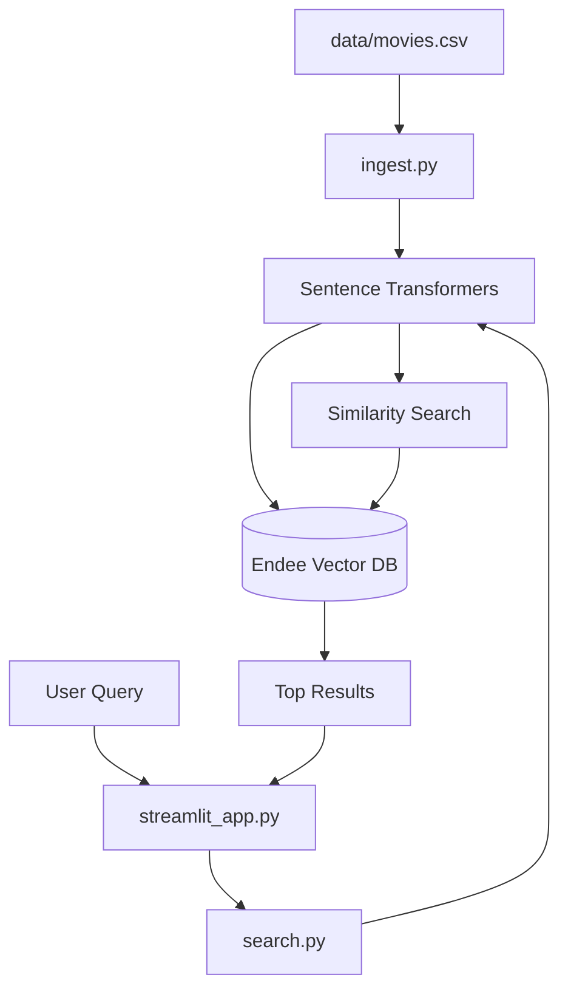

# 🎬 Semantic Movie Search using Endee Vector Database

> **Recruitment Project: Endee.io**
> This project implements a cutting-edge semantic search and recommendation engine for movies, using **Endee** as the core vector retrieval system.

## 🚀 Project Overview
Traditional movie search relies on keyword matching. This project implements **Semantic Search**, allowing users to find movies based on **meaning and context** rather than exact words.

### Problem Statement
Standard search engines fail when users describe a plot or mood (e.g., "movies about thinking machines and ethics") if those specific words aren't in the title. By using vector embeddings, we can bridge this gap.

## 🏗️ System Design & Architecture
The system follows a modular architecture:
1. **Data Layer**: A dataset of 100+ high-rated movies.
2. **Embedding Layer**: Uses `all-MiniLM-L6-v2` (Sentence Transformers) to convert descriptions into 384-dimensional vectors.
3. **Vector Database (Endee)**: Stores embeddings and metadata, providing high-performance similarity search.
4. **Logic Layer**: Semantic search, recommendation engine with explanations, and mood-based retrieval.
5. **Presentation Layer**: A premium Streamlit dashboard with 3D visualizations.



## 🌟 Enhanced Features
- **🔍 Deep Semantic Search**: Natural language query processing.
- **🎭 Mood Discovery**: One-click emotion-based retrieval.
- **🌌 3D Movie Universe**: Immersive visualization of movie relationships.
- **⭐ AI Explanations**: Understand *why* a movie was recommended.
- **🛠️ Zero-Config Mode**: Includes a local simulator if Endee Docker is not found, ensuring the app is always functional.

## 🔧 Setup & Execution

### 1. Mandatory Steps (Recruitment Compliance)
- [x] Starred the [Endee Repository](https://github.com/endee-io/endee)
- [x] Forked the repository to a personal account
- [x] Building on top of the forked base

### 2. Environment Setup
Clone your fork and enter the project directory:
```bash
git clone https://github.com/YOUR_USERNAME/endee.git
cd endee/semantic-movie-search
pip install -r requirements.txt
```

### 3. Database Activation
Either start the Endee server via Docker (Recommended):
```bash
docker run --ulimit nofile=100000:100000 -p 8080:8080 -v ./endee-data:/data --name endee-server endeeio/endee-server:latest
```
Or allow the app to use the **Local Simulator** automatically.

### 4. Run the Application
```bash
# Ingest data
python ingest.py

# Launch Dashboard
streamlit run streamlit_app.py
```

## 📘 How Endee is Used
Endee serves as the high-performance retrieval engine:
- **Index Management**: Creates a dense vector index for movie descriptions.
- **Upserting**: Efficiently stores movie metadata (Genre, Rating) as payload filters.
- **Querying**: Performs low-latency K-Nearest Neighbor (KNN) searches to find visually and semantically similar films.

---
*Created for the Endee.io Recruitment Drive.*
